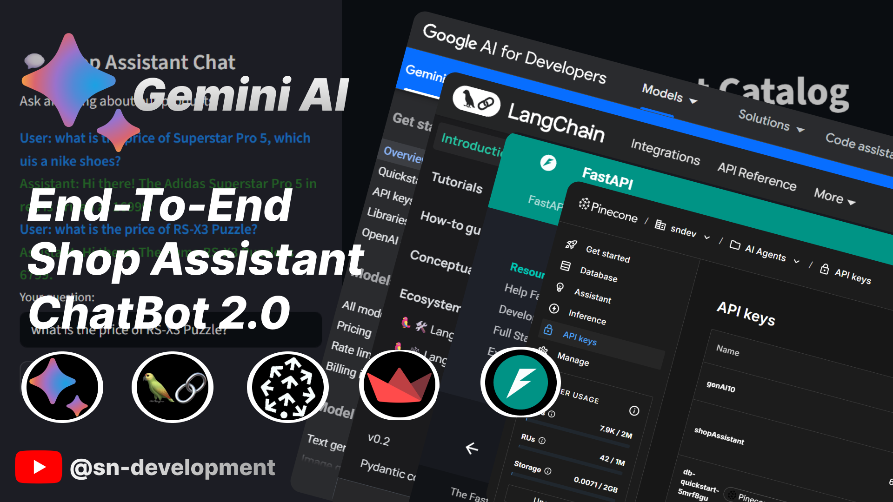

<div align="center">
  
  <h1>🏍️ Shop Assistant RAG Chatbot</h1>
  <p>A smart AI-powered assistant that helps users explore a shop's product catalog using natural language queries.</p>
</div>

---

## 📌 Overview

This project demonstrates how to build a **RAG (Retrieval-Augmented Generation)** based **Shop Assistant Chatbot** using:

- **🧠 Google Gemini** for LLM responses and embeddings
- **📆 Pinecone** for vector search
- **�� MySQL** for product data storage
- **⚖️ FastAPI** backend
- **🎨 Streamlit** frontend

> Users can **browse, search, and chat** about products via a sidebar chatbot while viewing a catalog in real-time!

---

## 🔥 Features

👉 Chatbot trained on actual product descriptions
👉 Live filtering by **brand**, **gender**, and **price**
👉 Modular and scalable backend + frontend
👉 Google Gemini + Pinecone-powered retrieval
👉 Full-stack Python implementation

---

## 🧱 Folder Structure

```
CustomerCareChatbot/
│
├── backend/              # FastAPI backend
│   ├── main.py
│   ├── routes/
│   └── services/
│
├── frontend/             # Streamlit frontend
│   └── app.py
│
├── embedding/            # Data loading and Pinecone sync
│   ├── data_insertion.py
│   └── sync_pinecone.py
│
├── .env
├── README.md
├── uv.toml
└── architecture.pdf      # System architecture diagram
```

---

## ⚙️ Setup Instructions

### 1️⃣ Clone the Repository

```bash
git clone https://github.com/snsupratim/ShopAssistantChatbot2.0.git
cd ShopAssistantChatbot2.0
```

### 2️⃣ Install uv and Setup Virtual Environment

```bash
pip install uv
uv venv
uv pip install -r requirements.txt
```

> Or use `uv pip install fastapi streamlit mysql-connector-python langchain-google-genai langchain-pinecone pinecone-client` if no requirements.txt

---

### 3️⃣ Prepare `.env` file

Create a `.env` file in the root directory:

```
DB_PASSWORD=your_mysql_password
GOOGLE_API_KEY=your_gemini_api_key
PINECONE_API_KEY=your_pinecone_api_key
```

---

### 4️⃣ Insert Product Data into MySQL

```bash
python embedding/data_insertion.py
```

---

### 5️⃣ Generate Embeddings & Sync to Pinecone

```bash
python embedding/sync_pinecone.py
```

---

### 6️⃣ Start FastAPI Backend

```bash
uvicorn backend.main:app --reload
```

---

### 7️⃣ Start Streamlit Frontend

```bash
streamlit run frontend/app.py
```

---

## 🧪 Example Questions to Try

- "Do you have any red dresses for women?"
- "Show me Puma shoes under 3000."
- "What are the Nike products available?"
- "Tell me about affordable items for men."
- "Any stylish sneakers in black?"
- "What's the price of the Adidas t-shirt?"

---

## 📊 Architecture & Workflow

Please see the detailed architecture diagram and modular workflow in this PDF:

📄 [Download architecture.pdf](./architecture.pdf)

---

## 💡 Tech Stack

| Tool          | Purpose                |
| ------------- | ---------------------- |
| FastAPI       | REST API backend       |
| Streamlit     | Frontend & Chat UI     |
| MySQL         | Product database       |
| Pinecone      | Vector DB for RAG      |
| Google Gemini | Embedding + Chat Model |
| LangChain     | LLM orchestration      |

---

## 🙌 Credits

- Developed by [Supratim Nag](https://github.com/snsupratim)
- Inspired by modern RAG-based AI systems

---

## 📽️ YouTube Demo

🔵 Watch the video tutorial:
**👉 [https://youtube.com/@sn-develpoment](https://youtube.com/@sn-develpoment)**

---

## 📝 License

This project is licensed under the MIT License.
